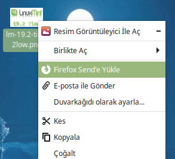

# nemo-ffsend
ffsend action for Nemo file manager



You can upload file or dir to Firefox Send with this Nemo action by archived and passworded

Bu Nemo aksiyonu ile Firefox Send'e şıkıştırılmış ve parola korulamalı olarak dosya ya da dizin gönderebilirsiniz.

How to Install / Nasıl Kurulur

1. Download ffsend binary from following link.

   Aşağıdaki bağlantıdan ffsend ikili dosyasını indirin.

   https://github.com/timvisee/ffsend/releases

2. Copy ffsend file to /opt dir and rename to ffsend.

   ffsend dosyasını /opt dizinine kopyalayın ve adını ffsend olarak değiştirin.

3. Install nemo-ffsend action with following commands.

   nemo-ffsend aksiyonunu aşağıdaki komutlarla kurun.

  ```bash
  wget https://raw.githubusercontent.com/kelebek333/nemo-ffsend/master/usr/share/nemo/actions/ffsend.nemo_action`

  sudo mv ./ffsend.nemo_action /usr/share/nemo/actions
  ```
